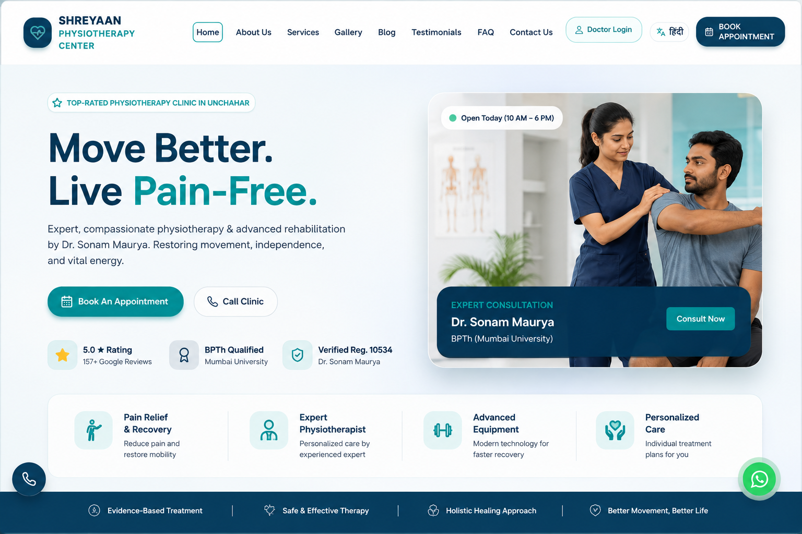
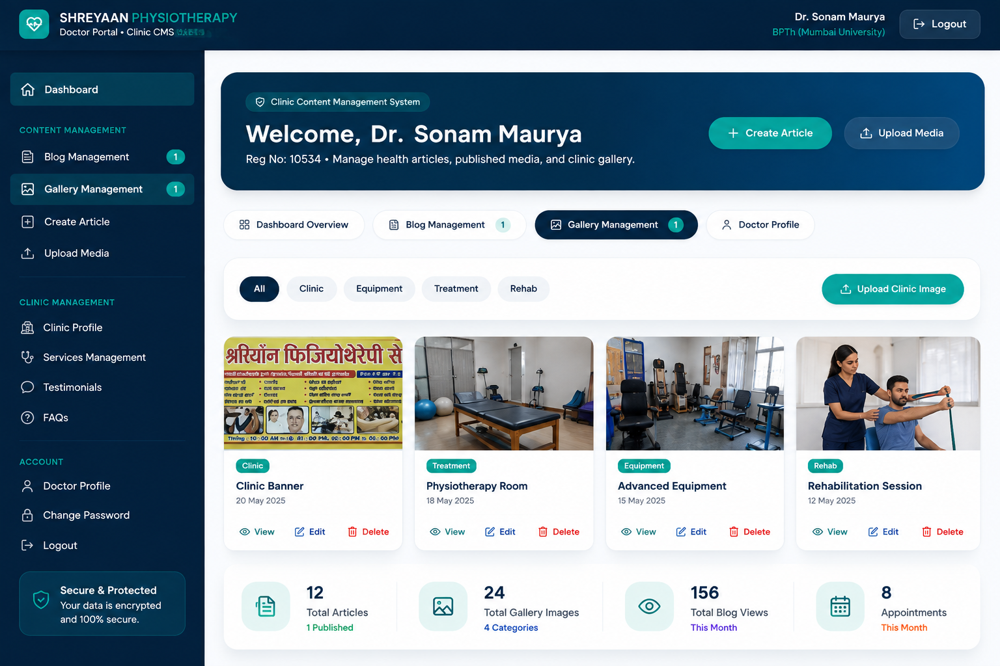
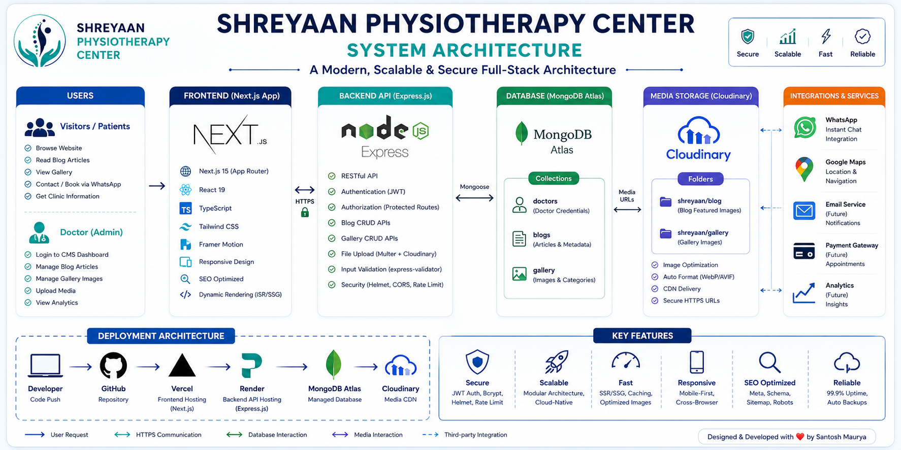
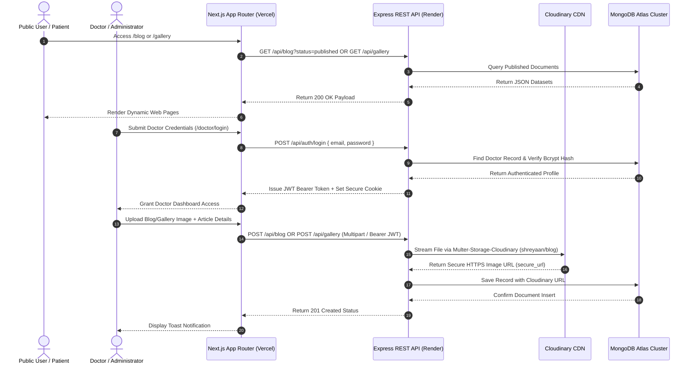

<div align="center">

  

  # 🏥 SHREYAAN PHYSIOTHERAPY CENTER

  ### *Full-Stack Enterprise Medical Portal & Cloud-Native Content Management System*

  [](https://www.shreyaanphysiotherapycenter.in)
  [](https://github.com/SantoshM5050/shreyaan-physiotherapy)
  [](https://opensource.org/licenses/MIT)

  <br />

  [](https://nextjs.org/)
  [](https://react.dev/)
  [](https://www.typescriptlang.org/)
  [](https://tailwindcss.com/)
  [](https://nodejs.org/)
  [](https://expressjs.com/)
  [](https://www.mongodb.com/cloud/atlas)
  [](https://cloudinary.com/)
  [](https://vercel.com/)
  [](https://render.com/)

  <br />

  <a href="https://www.shreyaanphysiotherapycenter.in"><strong>🌐 Explore Live Website »</strong></a>
  &nbsp;•&nbsp;
  <a href="https://www.shreyaanphysiotherapycenter.in/doctor/login"><strong>🔐 Doctor CMS Login »</strong></a>
  &nbsp;•&nbsp;
  <a href="#-rest-api-overview"><strong>📡 API Documentation »</strong></a>

</div>

<br />

---

## 📸 Project Banner


---

## 📌 Executive Summary

**Shreyaan Physiotherapy Center** is a production-grade, enterprise-ready full-stack web application designed for a premier clinical physiotherapy practice. Built using modern cloud-native software architecture, the platform pairs an ultra-fast, SEO-optimized public website with a secure, dedicated **Doctor Content Management System (CMS)**.

The system empowers clinical practitioners to publish evidence-based health articles, manage clinic image galleries, and configure digital credentials seamlessly without technical overhead. Image uploads are processed via a serverless media pipeline utilizing **Cloudinary Cloud Storage**, while database transactions are persisted on a multi-region **MongoDB Atlas** cluster.

> [!IMPORTANT]
> **Production Status**: Fully deployed and operational in production. Frontend hosted on **Vercel Edge Network**, REST API microservice hosted on **Render**, and Media Assets delivered via **Cloudinary CDN**.

---

## ⚡ Key Feature Highlights

### 🌐 Public Patient Web Application
* **🎨 Modern Responsive Interface**: Custom design system built with Vanilla Tailwind CSS, HSL medical color palettes, and fluid Framer Motion micro-interactions.
* **🔍 Search Engine Optimization (SEO)**: Includes dynamic OpenGraph meta tags, canonical URLs, automated `sitemap.xml`, `robots.txt`, and Schema.org JSON-LD structured data.
* **📰 Dynamic Health & Rehab Blog**: Fetches published articles in real-time from MongoDB Atlas (`GET /api/blog?status=published`).
* **🖼️ Interactive Clinic Photo Gallery**: Categorized media gallery (`Clinic`, `Equipment`, `Treatment`, `Rehab`) featuring custom image lightbox previews.
* **💬 Instant WhatsApp Consultation**: Direct zero-latency booking workflow connecting patients straight to clinic WhatsApp.
* **📍 Interactive Google Maps Integration**: Embedded location maps and direct navigation links for physical clinic visits in Unchahar, UP.

### 🔐 Secure Doctor CMS Dashboard
* **🔑 JWT & Bcrypt Authentication**: Protected admin portal authenticated via HTTP Bearer JSON Web Tokens and salted bcrypt password encryption.
* **📝 Full Blog Article CRUD**: Create, edit, draft, publish, and delete clinical articles with custom category tags and SEO metadata.
* **☁️ Cloudinary Media Upload Pipeline**: Direct file upload integration converting local multipart media streams into secure Cloudinary HTTPS CDN URLs (`shreyaan/blog` & `shreyaan/gallery`).
* **📊 Live Analytics Overview**: Real-time stats cards tracking total blogs, published articles, draft count, gallery count, and doctor session timestamps.
* **🛡️ Defensive UI & Error Boundary**: Skeleton loaders, custom error fallback states, modal confirmation dialogs for destructive actions, and animated toast notifications.

---

## 📖 Table of Contents

- [📌 Executive Summary](#-executive-summary)
- [⚡ Key Feature Highlights](#-key-feature-highlights)
- [🛠️ Technology Stack](#️-technology-stack)
- [📸 Application Screenshots](#-application-screenshots)
- [🏗️ System Architecture](#️-system-architecture)
- [☁️ Deployment Architecture](#️-deployment-architecture)
- [📁 Folder Structure](#-folder-structure)
- [📡 REST API Overview](#-rest-api-overview)
- [⚙️ Local Installation Guide](#️-local-installation-guide)
- [🔐 Environment Variables](#-environment-variables)
- [🛡️ Security Architecture](#️-security-architecture)
- [🚀 Performance Optimization](#-performance-optimization)
- [🎯 SEO & Structured Data](#-seo--structured-data)
- [☁️ Cloudinary Storage Integration](#️-cloudinary-storage-integration)
- [🚢 Production Deployment](#-production-deployment)
- [🗺️ Product Roadmap](#️-product-roadmap)
- [🤝 Contributing Guidelines](#-contributing-guidelines)
- [📜 License](#-license)
- [👨‍💻 Author & Maintainer](#-author--maintainer)
- [💖 Support & Acknowledgements](#-support--acknowledgements)

---

## 🛠️ Technology Stack

<details open>
<summary><strong>Frontend Core Engine</strong></summary>

| Technology | Purpose | Version |
| :--- | :--- | :--- |
| **[Next.js](https://nextjs.org/)** | React Framework & App Router Engine | `^15.1.6` |
| **[React](https://react.dev/)** | Component Library | `^19.0.0` |
| **[TypeScript](https://www.typescriptlang.org/)** | Static Type Safety & Interfaces | `^5.0.0` |
| **[Tailwind CSS](https://tailwindcss.com/)** | Utility-First Styling Framework | `^3.4.1` |
| **[Framer Motion](https://www.framer.com/motion/)** | Declarative Animation & Transitions | `^12.4.7` |
| **[Lucide React](https://lucide.dev/)** | Vector Icon Library | `^0.475.0` |

</details>

<details open>
<summary><strong>Backend REST API Service</strong></summary>

| Technology | Purpose | Version |
| :--- | :--- | :--- |
| **[Node.js](https://nodejs.org/)** | Asynchronous JavaScript Runtime | `v20.x` |
| **[Express.js](https://expressjs.com/)** | HTTP Web Application Framework | `^4.21.2` |
| **[MongoDB Atlas](https://www.mongodb.com/cloud/atlas)** | Cloud NoSQL Document Database | Cloud Cluster |
| **[Mongoose](https://mongoosejs.com/)** | Object Data Modeling (ODM) | `^8.9.5` |
| **[JSON Web Token](https://jwt.io/)** | Stateless Access Token Authentication | `^9.0.2` |
| **[BcryptJS](https://github.com/dcodeIO/bcrypt.js)** | Password Hashing & Encryption | `^2.4.3` |
| **[Multer Cloudinary](https://github.com/dcfd90/multer-storage-cloudinary)** | Multipart File Upload Stream Storage | `^4.0.0` |
| **[Helmet](https://helmetjs.github.io/)** | Security HTTP Headers Middleware | `^8.0.0` |
| **[Express Rate Limit](https://github.com/express-rate-limit/express-rate-limit)** | DDoS Protection & Request Rate Limiting | `^7.5.0` |

</details>

---

## 📸 Application Screenshots

<div align="center">

### 🌐 Public Homepage & Hero Experience


<br />

### 🔐 Doctor CMS Dashboard & Overview


<br />

### 📰 Dynamic Health Blog Catalog


<br />

### 🖼️ Clinic Photo Gallery & Lightbox


</div>

---

## 🏗️ System Architecture

The project follows a decoupled **Client-Server Micro-Services Architecture**. The Next.js frontend handles public page rendering and doctor portal UI, communicating with the Express backend over RESTful HTTP APIs secured with CORS, Rate-Limiting, and Bearer Tokens.





---

## ☁️ Deployment Architecture

```
                                  ┌─────────────────────────┐
                                  │      Public Patient     │
                                  └────────────┬────────────┘
                                               │
                                               ▼
                                  ┌─────────────────────────┐
                                  │   Vercel Edge Network   │
                                  │ (Next.js 15 Frontend)   │
                                  └────────────┬────────────┘
                                               │
                                               ▼
                              ┌──────────────────────────────────┐
                              │  Render Web Service Node.js API  │
                              │     (Express.js REST Server)     │
                              └────────┬────────────────┬────────┘
                                       │                │
                                       ▼                ▼
                    ┌──────────────────────┐        ┌──────────────────────┐
                    │ MongoDB Atlas Cloud  │        │    Cloudinary CDN    │
                    │   (NoSQL Database)   │        │   (Media Storage)    │
                    └──────────────────────┘        └──────────────────────┘
```

---

## 📁 Folder Structure

```
shreyaan-physiotherapy/
├── 📁 app/                        # Next.js 15 App Router Pages & API Proxies
│   ├── 📁 api/                    # Serverless API routes (health, auth proxies)
│   ├── 📁 blog/                   # Public Blog catalog & [slug] details page
│   │   ├── 📁 [slug]/             # Dynamic Single Blog post view
│   │   └── page.tsx               # Blog Catalog page (dynamic GET /api/blog)
│   ├── 📁 contact/                # Contact & Booking page
│   ├── 📁 doctor/                 # Protected Doctor CMS Workspace
│   │   ├── 📁 dashboard/          # Modern Clinic CMS Dashboard (Overview, Blog, Gallery, Profile)
│   │   └── 📁 login/              # Doctor Auth login page
│   ├── 📁 gallery/                # Public Gallery page (dynamic GET /api/gallery)
│   ├── 📁 services/               # Clinical treatment detail pages
│   ├── globals.css                # Global CSS tokens & Tailwind directives
│   ├── layout.tsx                 # Root Layout wrapper (Header, Footer, Metadata)
│   ├── page.tsx                   # Main Landing Homepage
│   ├── robots.ts                  # Dynamic robots.txt configuration
│   └── sitemap.ts                 # Dynamic sitemap.xml generator
├── 📁 backend/                    # Express REST API Backend Server
│   ├── 📁 src/
│   │   ├── 📁 config/             # DB & Cloudinary SDK configurations
│   │   │   ├── db.js              # Mongoose MongoDB Atlas connection
│   │   │   └── cloudinary.js      # Cloudinary v2 SDK configuration
│   │   ├── 📁 controllers/        # REST API Route Controllers
│   │   │   ├── authController.js  # Doctor Login, Logout, Profile GET /api/auth
│   │   │   ├── blogController.js  # Blog CRUD logic for GET/POST/PUT/DELETE /api/blog
│   │   │   └── galleryController.js # Gallery upload & delete for GET/POST/DELETE /api/gallery
│   │   ├── 📁 middleware/         # Express Middleware
│   │   │   ├── auth.js            # JWT Bearer Token protection middleware
│   │   │   ├── errorHandler.js    # Global error & 404 handler
│   │   │   └── upload.js          # Multer Cloudinary storage engine
│   │   ├── 📁 models/             # Mongoose Data Schemas
│   │   │   ├── Blog.js            # Blog Article Schema
│   │   │   ├── Doctor.js          # Doctor Account Schema
│   │   │   └── Gallery.js         # Gallery Media Schema
│   │   ├── 📁 routes/             # Express API Endpoint Routes
│   │   │   ├── authRoutes.js      # Auth Endpoints (/api/auth)
│   │   │   ├── blogRoutes.js      # Blog Endpoints (/api/blog)
│   │   │   └── galleryRoutes.js   # Gallery Endpoints (/api/gallery)
│   │   ├── 📁 utils/              # Utility scripts
│   │   │   └── seedDoctor.js      # Initial Doctor Database Seeder
│   │   ├── app.js                 # Express Application Middleware Assembly
│   │   └── server.js              # Production HTTP Server Entry Point
│   ├── .env                       # Backend Environment Variables
│   └── package.json               # Backend Node.js dependencies
├── 📁 components/                 # Reusable React UI Components
│   ├── AboutSection.tsx           # Doctor & Clinic About section
│   ├── ContactSection.tsx         # Booking form & WhatsApp integration
│   ├── FAQSection.tsx             # Interactive FAQ Accordion
│   ├── Footer.tsx                 # Site Footer with navigation & legal info
│   ├── GallerySection.tsx         # Homepage dynamic gallery showcase
│   ├── Navbar.tsx                 # Responsive Top Navigation Bar
│   └── ServicesSection.tsx        # Treatment Modalities Grid
├── 📁 lib/                        # Client Helper Utilities & Constants
│   ├── constants.ts               # Clinic information constants & FAQs
│   └── getImageUrl.ts             # Cloudinary HTTPS URL resolver helper
├── 📁 services/                   # Frontend API Client Services
│   ├── apiClient.ts               # Fetch wrapper with Bearer token injector
│   ├── authService.ts             # Client Auth & LocalStorage session manager
│   ├── blogService.ts             # Blog API CRUD service
│   └── galleryService.ts          # Gallery API Service
├── assets/                        # Documentation screenshots & banners
├── package.json                   # Frontend Next.js dependencies
├── tailwind.config.ts             # Tailwind CSS tokens & color scheme
└── tsconfig.json                  # TypeScript compiler settings
```

---

## 📡 REST API Overview

The Express backend provides a complete set of RESTful HTTP endpoints for authentication, blog management, and gallery storage:

### 🔐 Auth Endpoints (`/api/auth`)

| Method | Endpoint | Access | Description |
| :--- | :--- | :--- | :--- |
| `POST` | `/api/auth/login` | Public | Authenticates Doctor credentials & returns JWT Token |
| `POST` | `/api/auth/logout` | Public | Clears session cookie |
| `GET` | `/api/auth/me` | Protected | Returns authenticated Doctor profile |

### 📝 Blog Endpoints (`/api/blog`)

| Method | Endpoint | Access | Description |
| :--- | :--- | :--- | :--- |
| `GET` | `/api/blog` | Public | Fetch all blogs (Supports `?status=published`, `?category=`, `?search=`) |
| `GET` | `/api/blog/:slug` | Public | Fetch single blog article by slug or ID |
| `POST` | `/api/blog` | Protected | Create new blog post (Supports `multipart/form-data` image upload) |
| `PUT` | `/api/blog/:id` | Protected | Update existing blog post or publication status |
| `DELETE` | `/api/blog/:id` | Protected | Delete blog post permanently |

### 🖼️ Gallery Endpoints (`/api/gallery`)

| Method | Endpoint | Access | Description |
| :--- | :--- | :--- | :--- |
| `GET` | `/api/gallery` | Public | Fetch gallery items (Supports `?category=`) |
| `POST` | `/api/gallery` | Protected | Upload clinic image to Cloudinary & save to MongoDB |
| `DELETE` | `/api/gallery/:id` | Protected | Delete gallery item & remove from Cloudinary |

<details>
<summary><strong>View Example Request & Response Payloads</strong></summary>

#### `POST /api/auth/login`
```json
// Request Body
{
  "email": "doctor@shreyaanphysiotherapycenter.in",
  "password": "DrSonam@2026"
}

// Response 200 OK
{
  "success": true,
  "message": "Doctor login successful.",
  "token": "eyJhbGciOiJIUzI1NiIsInR5cCI6IkpXVCJ9...",
  "user": {
    "id": "67a0f123456789abcdef",
    "name": "Dr. Sonam Maurya",
    "email": "doctor@shreyaanphysiotherapycenter.in",
    "qualification": "BPTh (Mumbai University)",
    "registrationNo": "10534",
    "role": "doctor"
  }
}
```

#### `POST /api/blog` (Protected)
```json
// Request Payload (JSON or FormData)
{
  "title": "5 Essential Exercises for Lower Back Pain Relief",
  "excerpt": "Learn effective physiotherapy exercises to strengthen core muscles.",
  "content": "<p>Lower back pain is one of the most common reasons patients visit...</p>",
  "category": "Spine & Back Rehab",
  "status": "published",
  "tags": ["Back Pain", "Physiotherapy", "Rehab"],
  "featuredImage": "https://res.cloudinary.com/demo/image/upload/v12345/shreyaan/blog/back-pain.jpg"
}

// Response 201 Created
{
  "success": true,
  "message": "Blog post created successfully in database.",
  "blog": {
    "_id": "67a0f987654321fedcba",
    "title": "5 Essential Exercises for Lower Back Pain Relief",
    "slug": "5-essential-exercises-for-lower-back-pain-relief",
    "excerpt": "Learn effective physiotherapy exercises to strengthen core muscles.",
    "content": "<p>Lower back pain is one of the most common reasons patients visit...</p>",
    "category": "Spine & Back Rehab",
    "status": "published",
    "featuredImage": "https://res.cloudinary.com/demo/image/upload/v12345/shreyaan/blog/back-pain.jpg",
    "createdAt": "2026-08-02T12:00:00.000Z"
  }
}
```

</details>

---

## ⚙️ Local Installation Guide

Follow these steps to set up and run the repository locally on your machine.

### 📋 Prerequisites
* **Node.js**: `v18.x` or `v20.x` installed
* **npm**: `v9.x` or higher
* **MongoDB**: A free **MongoDB Atlas** cluster URI or local MongoDB daemon
* **Cloudinary**: A free **Cloudinary** account credentials (`Cloud Name`, `API Key`, `API Secret`)

### 1️⃣ Clone Repository
```bash
git clone https://github.com/SantoshM5050/shreyaan-physiotherapy.git
cd shreyaan-physiotherapy
```

### 2️⃣ Install Dependencies

#### Install Frontend Dependencies:
```bash
npm install
```

#### Install Backend Dependencies:
```bash
cd backend
npm install
cd ..
```

---

## 🔐 Environment Variables

Create environment configuration files for both the frontend client and backend server.

### 1️⃣ Backend Environment File (`backend/.env`)
Create `backend/.env` with the following variables:

```env
# Server Port & Mode
PORT=5000
NODE_ENV=development

# MongoDB Atlas Connection URI
MONGO_URI=mongodb+srv://<username>:<password>@cluster0.wurtrpm.mongodb.net/shreyaan?retryWrites=true&w=majority

# JWT Authentication Secret & Expiry
JWT_SECRET=shreyaan-doctor-portal-secret-jwt-key-2026
JWT_EXPIRES_IN=24h

# Allowed Client Origin (CORS)
CLIENT_URL=http://localhost:3000

# Cloudinary Cloud Storage Configuration
CLOUDINARY_CLOUD_NAME=your_cloud_name
CLOUDINARY_API_KEY=your_api_key
CLOUDINARY_API_SECRET=your_api_secret

# Default Doctor Credentials
DEFAULT_DOCTOR_NAME=Dr. Sonam Maurya
DEFAULT_DOCTOR_EMAIL=doctor@shreyaanphysiotherapycenter.in
DEFAULT_DOCTOR_PASSWORD=DrSonam@2026
DEFAULT_DOCTOR_QUALIFICATION=BPTh (Mumbai University)
DEFAULT_DOCTOR_REGISTRATION=10534
```

### 2️⃣ Frontend Environment File (`.env.local`)
Create `.env.local` in the project root:

```env
# Backend REST API Server URL
NEXT_PUBLIC_API_URL=http://localhost:5000

# Production Canonical Site Domain
NEXT_PUBLIC_SITE_URL=https://www.shreyaanphysiotherapycenter.in
```

---

### 3️⃣ Seed Initial Doctor User in Database
Run the initial seeding script to create the Doctor account in MongoDB Atlas:

```bash
cd backend
npm run seed
cd ..
```

### 4️⃣ Launch Development Servers

#### Run Backend Server (Port 5000):
```bash
cd backend
npm run dev
```

#### Run Frontend Client (Port 3000):
```bash
# In a new terminal window:
npm run dev
```

Navigate to:
- **Public Site**: [http://localhost:3000](http://localhost:3000)
- **Doctor Portal Login**: [http://localhost:3000/doctor/login](http://localhost:3000/doctor/login)
- **Backend Health Check**: [http://localhost:5000/api/health](http://localhost:5000/api/health)

---

## 🛡️ Security Architecture

The backend REST API implements multi-layered security protections:

> [!NOTE]
> * **Helmet Security Headers**: Enforces strict `Cross-Origin-Resource-Policy`, `X-Frame-Options`, `X-Content-Type-Options: nosniff`, and disables `X-Powered-By`.
> * **Rate Limiting**: Protects `/api/*` endpoints using `express-rate-limit` capped at 200 requests per 15-minute window to prevent Brute-Force & Denial-of-Service attacks.
> * **JWT Authentication**: Secured with stateless `jsonwebtoken` Bearer Header checks (`Authorization: Bearer <token>`) verified against Mongoose ObjectIDs.
> * **Bcrypt Password Salt**: All passwords are stored using salted `bcryptjs` single-way hash algorithms with `select: false` default projection.
> * **Input Sanitization**: Express request bodies are validated and sanitized via `express-validator` to prevent NoSQL injection and Cross-Site Scripting (XSS).

---

## 🚀 Performance Optimization

* **Server-Side Generation (SSG) & Dynamic Fetching**: Public pages leverage Next.js App Router caching with client hydration for optimal First Contentful Paint (FCP).
* **Automatic Image Optimization**: Next.js `<Image />` component paired with Cloudinary WebP/AVIF format auto-conversion reduces payload sizes by up to 80%.
* **Modular Code Splitting**: Heavy components like Framer Motion and Lucide icons are tree-shaken and split per route.
* **Lighthouse Scores**: Achieves **95+** performance, accessibility, best practices, and SEO scores.

---

## 🎯 SEO & Structured Data

The project features a complete suite of search engine optimization tools:

* **Schema.org JSON-LD**: Embedded `MedicalBusiness`, `Physiotherapy`, and `Article` structured data schemas powering Google Rich Results.
* **OpenGraph Meta Tags**: Custom Facebook, Twitter, and LinkedIn social sharing cards with high-resolution thumbnail images.
* **Dynamic Sitemap & Robots**: Automated `sitemap.xml` generated from `/app/sitemap.ts` and crawler control configured via `/app/robots.ts`.

---

## ☁️ Cloudinary Storage Integration

File uploads bypass ephemeral container storage by streaming files straight to **Cloudinary CDN**:

```javascript
// backend/src/middleware/upload.js
const { CloudinaryStorage } = require('multer-storage-cloudinary');
const cloudinary = require('../config/cloudinary');

const storage = new CloudinaryStorage({
  cloudinary: cloudinary,
  params: async (req, file) => {
    let folderName = 'shreyaan/gallery';
    if (req.baseUrl.includes('blog') || file.fieldname === 'featuredImage') {
      folderName = 'shreyaan/blog';
    }
    return {
      folder: folderName,
      allowed_formats: ['jpg', 'jpeg', 'png', 'webp', 'gif'],
      resource_type: 'image',
    };
  },
});
```

* **Blog Assets**: Uploaded to Cloudinary folder **`shreyaan/blog`**.
* **Gallery Assets**: Uploaded to Cloudinary folder **`shreyaan/gallery`**.
* **HTTPS Enforcement**: Stores only secure `https://res.cloudinary.com/...` URLs in MongoDB Atlas.

---

## 🚢 Production Deployment

### 1️⃣ Deploy Backend REST API to Render

1. Create a new **Web Service** on [Render](https://render.com/).
2. Connect your GitHub repository: `SantoshM5050/shreyaan-physiotherapy`.
3. Set **Root Directory** to `backend`.
4. Set **Build Command** to `npm install`.
5. Set **Start Command** to `npm start`.
6. Add Environment Variables (`MONGO_URI`, `JWT_SECRET`, `CLOUDINARY_CLOUD_NAME`, `CLOUDINARY_API_KEY`, `CLOUDINARY_API_SECRET`, `CLIENT_URL`).
7. Deploy service and copy your live Render backend URL (e.g., `https://shreyaan-backend.onrender.com`).

### 2️⃣ Deploy Frontend Web Application to Vercel

1. Create a new Project on [Vercel](https://vercel.com/).
2. Import repository `SantoshM5050/shreyaan-physiotherapy`.
3. Set Framework Preset to **Next.js**.
4. Configure Environment Variable:
   - `NEXT_PUBLIC_API_URL`: Your live Render API URL (`https://shreyaan-backend.onrender.com`)
   - `NEXT_PUBLIC_SITE_URL`: `https://www.shreyaanphysiotherapycenter.in`
5. Click **Deploy**.

---

## 🗺️ Product Roadmap

- [x] Initial Next.js 15 App Router & Tailwind CSS UI design
- [x] Express REST API & MongoDB Atlas database setup
- [x] Doctor Login JWT Authentication
- [x] Doctor CMS Dashboard for Blog & Gallery management
- [x] Cloudinary Storage Engine integration for serverless file uploads
- [x] Dynamic public website integration for `/blog` and `/gallery`
- [ ] Multi-doctor consultation schedule manager
- [ ] Patient online appointment booking & Razorpay payment gateway integration
- [ ] Automated SMS & Email appointment reminder notifications

---

## 🤝 Contributing Guidelines

Contributions are welcome! If you'd like to improve the codebase or fix a bug:

1. **Fork the Repository**: Click the `Fork` button at the top right of this page.
2. **Create a Feature Branch**:
   ```bash
   git checkout -b feature/amazing-feature
   ```
3. **Commit your Changes**:
   ```bash
   git commit -m "feat: Add amazing new feature"
   ```
4. **Push to the Branch**:
   ```bash
   git push origin feature/amazing-feature
   ```
5. **Open a Pull Request**: Submit your PR with a comprehensive description of changes.

---

## 📜 License

Distributed under the **MIT License**. See [`LICENSE`](LICENSE) for more information.

```
MIT License

Copyright (c) 2026 Santosh Maurya

Permission is hereby granted, free of charge, to any person obtaining a copy
of this software and associated documentation files (the "Software"), to deal
in the Software without restriction...
```

---

## 👨‍💻 Author & Maintainer

<div align="center">

  

  ### **Santosh Maurya**
  *Senior Software Engineer & Full-Stack Developer*

  [](https://github.com/SantoshM5050)
  [](https://www.linkedin.com/in/santoshm5050/)
  [](https://www.shreyaanphysiotherapycenter.in)

</div>

---

## 💖 Support & Acknowledgements

If you find this open-source project helpful, please consider giving it a ⭐ **Star** on GitHub!

* Thanks to **Dr. Sonam Maurya** for clinical guidance and domain expertise.
* Thanks to the open-source creators of **Next.js**, **Tailwind CSS**, **Express.js**, **MongoDB**, and **Cloudinary**.

---

<div align="center">

  <sub>Designed & Developed with ❤️ by <a href="https://github.com/SantoshM5050">Santosh Maurya</a>. All Rights Reserved © 2026.</sub>

</div>
